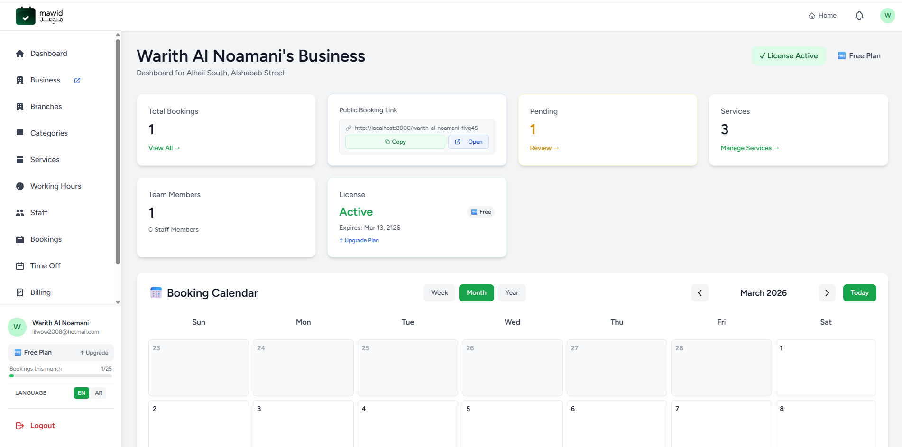
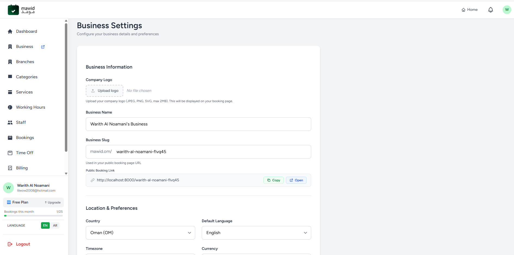
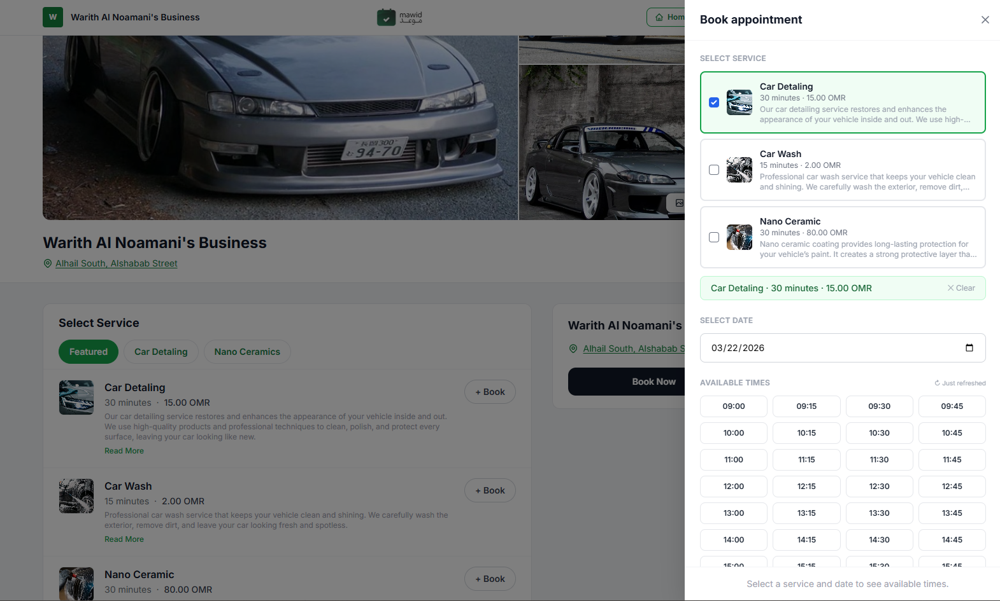
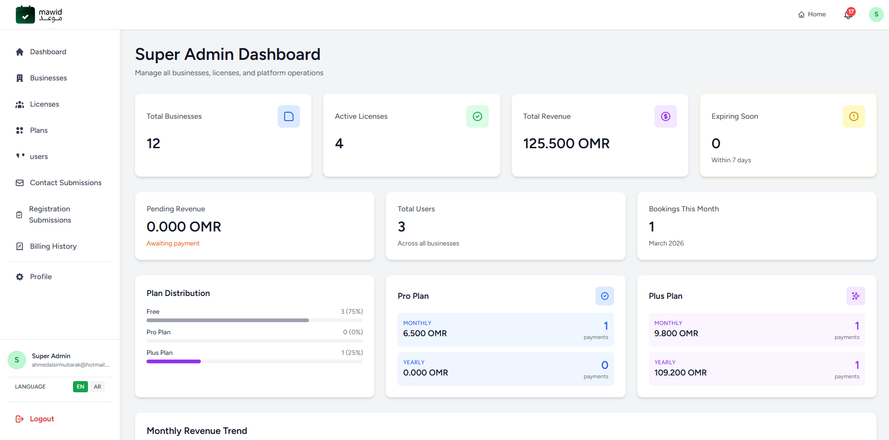
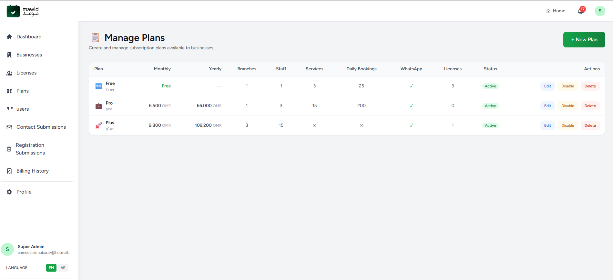

# Mawid —  Booking SaaS Platform

Mawid (Arabic: **موعد**, meaning *appointment*) is a multi-tenant SaaS platform built with **Laravel 12** that lets businesses manage services, staff, branches, and customer bookings through a clean dashboard. Each business gets a public booking page for customers and a full admin panel for management.

---

## Screenshots

### Company Admin Dashboard

> Overview of total bookings, pending appointments, services, staff, license status, and a full booking calendar.

### Business Settings

> Configure business name, slug, logo, location, timezone, currency, and default language.

### Public Booking Page

> Customer-facing booking page showing services, gallery, and the appointment booking panel with available time slots.

### Account Registration (Onboarding)

> Multi-step onboarding flow for new businesses — collects name, email, and phone number.

### Super Admin Dashboard

> Platform-wide overview — total businesses, active licenses, revenue, plan distribution, and monthly revenue trend.

### Plan Management

> Super admin view for creating and managing subscription plans with per-plan limits for branches, staff, services, and bookings.

---

## Features

### For Businesses (Company Admin)
- **Business profile** — logo, gallery, timezone, currency, contact details
- **Services** — create services with images, duration, price, and category
- **Staff management** — assign staff to branches, set working hours and time-off
- **Branches** — multi-location support per business
- **Bookings** — view, create manual bookings, reassign, change status, export CSV
- **Dashboard** — bookings calendar (day/week/month/year), staff workload analytics, top services
- **Billing** — subscription plan management, invoice history, saved card, auto-renewal

### For Customers
- Public booking page at `/{business-slug}`
- Browse services, pick a date/time slot, book with name, phone, email
- OTP email verification at registration
- Booking confirmation email

### For Staff
- Personal dashboard with today's bookings, upcoming calendar
- View assigned bookings

### For Super Admins
- Manage all businesses, users, licenses, and plans
- Manually issue/modify licenses
- View contact form submissions and registration requests
- Platform-wide billing overview

### Platform
- **Subscription plans** with configurable limits (staff, services, branches, daily/monthly bookings)
- **Paymob payment gateway** integration (card tokenisation, HMAC callback verification, auto-renewal)
- **Automatic subscription renewal** via a queued background job
- **Grace period** handling for past-due accounts, with a scheduled Artisan command
- **Email notifications** — booking confirmations, OTP, subscription events, staff notifications
- **Bilingual** — Arabic (`ar`) and English (`en`) with RTL layout support
- **PDF invoices** via DomPDF

---

## Tech Stack

| Layer | Technology |
|---|---|
| Backend | PHP 8.2+, Laravel 12 |
| Frontend | Blade, Tailwind CSS, Vite |
| Database | MySQL |
| Queue | Laravel database queue |
| Payments | Paymob |
| PDF | barryvdh/laravel-dompdf |
| Auth | Laravel Breeze (session-based) |

---

## Requirements

- PHP **8.2+** with extensions: `pdo_mysql`, `mbstring`, `openssl`, `tokenizer`, `xml`, `ctype`, `json`, `bcmath`, `gd`
- MySQL **8.0+**
- Node.js **18+** and npm
- Composer **2+**

---

## Installation

### 1. Clone the repository

```bash
git clone <repository-url> mawid-app
cd mawid-app
```

### 2. Install dependencies

```bash
composer install
npm install
```

### 3. Configure environment

```bash
cp .env.example .env
php artisan key:generate
```

Edit `.env` with your values (see [Environment Variables](#environment-variables) below).

### 4. Run migrations and seeders

```bash
php artisan migrate
php artisan db:seed   # optional: seeds demo plans and a super admin
```

### 5. Build frontend assets

```bash
npm run build
```

### 6. Start the development server

```bash
composer run dev
```

This concurrently starts the PHP dev server, the Vite dev server, and the queue worker.

---

## Quick Setup (single command)

```bash
composer run setup
```

This runs `composer install`, copies `.env.example`, generates a key, runs migrations, installs npm packages, and builds assets.

---

## Environment Variables

Key variables to configure in `.env`:

```dotenv
APP_NAME=Mawid
APP_ENV=production
APP_URL=https://yourdomain.com

DB_DATABASE=mawid
DB_USERNAME=root
DB_PASSWORD=secret

# Mail — all transactional emails
MAIL_MAILER=smtp
MAIL_HOST=smtp.example.com
MAIL_PORT=587
MAIL_USERNAME=your@email.com
MAIL_PASSWORD=secret
MAIL_FROM_ADDRESS=no-reply@yourdomain.com
MAIL_FROM_NAME="Mawid"

# Admin contact-form inbox (defaults to MAIL_FROM_ADDRESS)
ADMIN_MAIL_ADDRESS=admin@yourdomain.com

# Paymob payment gateway
PAYMOB_API_KEY=
PAYMOB_INTEGRATION_ID=
PAYMOB_IFRAME_ID=
PAYMOB_HMAC_SECRET=

# Queue (use 'database' for simple setups, 'redis' for production)
QUEUE_CONNECTION=database
```

---

## User Roles

| Role | Access |
|---|---|
| `super_admin` | Full platform access — businesses, users, licenses, plans |
| `company_admin` | Full access to their own business — services, staff, bookings, billing |
| `staff` | Their own bookings dashboard only |
| `customer` | Public booking flow only |

---

## Project Structure

```
app/
  Http/
    Controllers/
      Admin/        # Admin panel controllers (scoped by role)
    Middleware/     # Auth, role, active-user, OTP checks
    Requests/       # Form request validation classes
  Jobs/             # AutoRenewSubscriptionsJob
  Mail/             # All transactional email classes
  Models/           # Eloquent models
  Notifications/    # Laravel notifications
  Services/         # PlanService (plan limits & upgrades)
resources/
  views/
    admin/          # Admin panel Blade views
    auth/           # Login, register, OTP views
    public/         # Customer-facing booking pages
  lang/
    ar/             # Arabic translations
    en/             # English translations
routes/
  web.php           # All web routes
  auth.php          # Authentication routes
database/
  migrations/       # All database migrations
```

---

## License


© 2026 Ahmed. All rights reserved.

This project and its source code are proprietary and confidential.

You are NOT allowed to:
- Use this code for commercial purposes  
- Copy or redistribute this project  
- Modify or create derivative works  

Without explicit written permission from the author.
